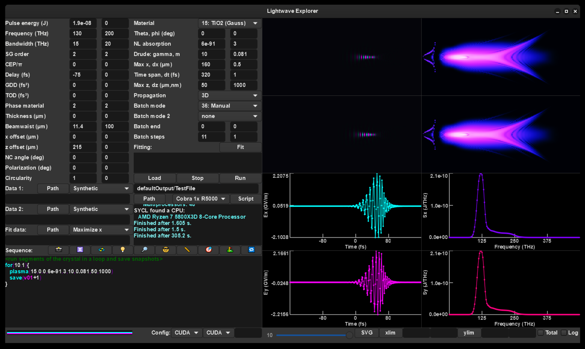

## <p style="text-align: center;">Lightwave Explorer</p>

<p style="text-align: center;">Nick Karpowicz</p>
<p style="text-align: center;">Max Planck Institute of Quantum Optics</p>

<p style="text-align: center;"></p>

<p style="text-align: center;">(icon made by Stable Diffusion)</p>

---


### What and why

Lightwave explorer is an open source nonlinear optics simulator, intended to be fast, visual, and flexible for students and researchers to play with ultrashort laser pulses and nonlinear optics without having to buy a laser first.

<p style="text-align: center;"></p>

The simulation was written CUDA in order to run quickly on modern graphics cards. I've subsequently generalized it so that it can be run in two other ways: SYCL on CPUs and Intel GPUs, and using OpenMP to run on CPUs. Accordingly, I hope that the results are fast enough that even complicated systems can be simulated within a human attention span.

---

#### Main goals:
 - _Easily extensible database of materials:_ Eveything the program knows about nonlinear materials comes from a human-readable text file giving the appropriate coefficients and tensors. If you want to use a new material, or you've done a measurement in a new range where typical extrapolations from older data isn't relevant, it's easy to add and correct. There are places for references for the key parameters, and these references are stored in the saved simulation results for future reference. Especially if you have simulations that you checked against experiments, I'd be very happy for you to add your crystal definitions to the central database in the project Github.
 - Accurate modeling of nonlinear optics using multiple, user-selectable physical models, including the unidirectional nonlinear wave equation and finite-difference time-domain approaches. This allows calculations that accommodate large systems where forward-propagation is an appropriate assumption, but also of etalon effects in thin crystals where reflections cannot be neglected.
 - _Efficient code so that complicated systems can be simulated in 3D:_ Real laser pulses can be messy, and if they weren't so before a nonlinear crystal, there's a good chance they are after (but not always). If things are slow, it's hard to go beyond one dimension on tolerable time scales, and then you miss out on the whole weird world of spatiotemporal couplings. Here you have options for rather fast simulations when there's a symmetry to apply (e.g. cylindrical or along one Cartesian dimension), alongside fully 3D propagation. Runs natively on both GPU and CPU to make use of whatever you have to work with.
 - _A graphical interface that lets you see what you're doing:_ A lot of us think in visual terms. Being able to adjust and scan parameters and immediately see what happens can really make it easier to understand what you're looking at. 
 - _A flexible sequence mode:_ By stringing together elements, not just nonlinear crystals but also spherical or parabolic mirrors, apertures, filters, free space propagation and other elements, simulate how  one interaction affects another. Sequences of events can be scripted and even programmed with loop functions to see how things change over the course of repeated interactions.
 - _Fitting modes:_ Sometimes the data that we measure depends on an interesting way on a parameter, and we'd actually like to go back and figure out what that parameter was from the data. Solving this kind of inverse problem can be tough when the parameter lives inside a partial differential equation, but by simulating the whole thing and doing a fit, you have a chance to do it! The fitting algorithm can be used to narrow down a huge space of variables to come at your best estimation of what was happening in an experiment, or to adjust your experimental system to maximize output at a given frequency.
 - _A Python module for easy postprocessing of the results:_ I hope that you get something interesting out that you want to plot and maybe publish. One of the nicest platforms for making nice plots is Python in my opinion (that's why the documentation is in a Jupyter notebook), so purely out of self interest I tried to make it easy to load the results in Python. The module also has some functions related to typical operations you'd like to do on the data to make it easy for all of us. The program also gives you a Matlab loading script for those who want to use that.
 - _Multiplatform:_ Works on Windows, Linux, and Mac.
 - _Command line interface for running on Linux/clusters:_ the simulation core can be compiled as a command line application to be controlled via the SLURM system. The GUI app can automatically configure the SLURM script, as well. I use this to run it on the clusters of the Max Planck Society, and other institutes and universities likely have similar systems. This lets you do a lot more if your personal resources are limited but you want to run simulations on a large grid or cover a lot of different parameters!

---

  ### Publications
  Lightwave Explorer has been used to perform the nonlinear optics simulations in the following papers!
  - Maciej Kowalczyk, *et al.*, Ultra-CEP-stable single-cycle pulses at 2.2 µm. [*Optica* **10**, 801-811 (2023).](https://opg.optica.org/optica/fulltext.cfm?uri=optica-10-6-801)
  - Najd Altwaijry, *et al.*, Broadband Photoconductive Sampling in Gallium Phosphide. [*Advanced Optical Materials* **11**, 2202994 (2023).](https://onlinelibrary.wiley.com/doi/full/10.1002/adom.202202994)
  - Hadil Kassab, *et al.*, In-line synthesis of multi-octave phase-stable infrared light, [*Optics Express* **31**, 24862 (2023).](https://opg.optica.org/oe/fulltext.cfm?uri=oe-31-15-24862)
---
  ### Installation on a Windows PC
  Download and extract either LightwaveExplorerWin64.zip or LightwaveExplorerWin64.7z from this [shared volume on the Max Planck Computing and Data Facility DataShare](https://datashare.mpcdf.mpg.de/s/oJj9eFYDBFmViFP). The LighwaveExplorer.exe application should just work.

  If you want to use SYCL for propagation, you need to install the [Intel® oneAPI DPC++/C++ Compiler Runtime for Windows](https://www.intel.com/content/www/us/en/developer/articles/tool/oneapi-standalone-components.html).

  The Python module for working with the results is also in that folder for convenience; I'd recommend putting it somewhere in your Python path if you're going to work with it a lot, otherwise just copy it into your working folder. It's also in this repo if you think of any improvements.

---

  ### Installation on Linux
  The easiest way is to use the AppImage located in the same [shared volume on the Max Planck Computing and Data Facility DataShare](https://datashare.mpcdf.mpg.de/s/oJj9eFYDBFmViFP) as the Windows one. You just have to download the image and mark it as executable (either under the properties in your file explorer or by "chmod +x LightwaveExplorer-x86_64.AppImage").

  The appimage should be in the same directory as the files CrystalDatabase.txt and DefaultValues.ini - you can also put them into /usr/share/LightwaveExplorer - I can make other options possible, not sure where the modern Linux user prefers.

  There is also a subfolder named CPUonly. This contains an appimage for a version released under the terms of the GNU Public License v3. This makes use of the FFTW library for performing Fourier transforms, instead of NVIDIA cuFFT or Intel MKL as used in the other version. If you are running it on an AMD CPU, this may give you a significant speedup (or if you perfer to only use GPL software, it's an option).

  Note that the appimage is slightly out of date at the moment, since my Linux install is a bit broken and I can't update it right now. If you want the latest version, follow the steps below to compile it locally! It's actually not too hard to do...

---

### Installation on Mac

There is an Intel version in the [shared volume](https://datashare.mpcdf.mpg.de/s/oJj9eFYDBFmViFP). This version also makes use of the FFTW library for Fourier transforms and is therefore released under the GNU Public License v3.

The application bundle contains all the required files. If you want to edit the crystal database or default settings, open the app as a folder (right click or control-click on the app and select "show package contents") - You will find them in the Resources folder.

A native version for the new Arm-based Macs is technically possible (and has been compiled) but you can't use it because Apple protects you from developers like me who refuse to pay them $100/year.

---
  ### How do I know which configuration to run?
  At the bottom of the window, you'll see two pulldown menus marked "Config" - these let you choose whether the simulation runs in CUDA, SYCL, or OpenMP. It should start set to the fastest option for your system, but if you don't have the right drivers/runtimes, it might step down to something else that is present. OpenMP is typically the slowest (except on Linux), but will run on basically any system.

  - If you have an Intel CPU, chances are it will have an integrated GPU, which can be used by SYCL. In my experience, the ones that show up as "Iris Graphics" are actually much faster than running the code on the actual CPU, while the ones named "HD Graphics" are sometimes slower. Just try them both.

  - The SYCL code compiles itself for your specific hardware the first time it runs. So, the first run will be slower than the rest - don't reject it because it that; subsequent runs will be faster!

  - The second pulldown is for offloading work onto other parts of your system. For example, if you are running a big batch of simulations on a CUDA-capable GPU, you can send some of them to the CPU to work on. This is what the second menu and following number do: chose the offload target, and the number to send to it. You don't have to use this if you don't want to.

  - Basically, the order in which you should choose the backends is: CUDA if you have something which supports it. If not, SYCL if you're on windows and/or have a supported Intel integrated GPU. You're running on CPU in Linux, the GPL3 version might be faster.

  ---
  ### Compilation in Visual Studio
  LWE was developed in Visual Studio, so you'll need that. You will also need [vcpkg](https://vcpkg.io), and use that to install dlib (make sure you get the 64-bit version, not the 32-bit one).
  
   Next, install the [CUDA development kit](https://developer.nvidia.com/cuda-downloads) from NVIDIA, and [Intel OneAPI](https://www.intel.com/content/www/us/en/developer/tools/oneapi/base-toolkit-download.html) (including the Math Kernel Library and the DPC++ compiler).
   
   Next, you'll need a compiled version of [GTK4](http://gtk.org) - the easiest way in my view was the gvsbuild option. I also keep a gtk.zip file in the shared folder for convenience, since it's a bit of a pain, and the current version is actually a bit broken on Windows. The resulting compiled thing should be kept in a folder next to the LightwaveExplorer folder (e.g. they're both in the same parent folder).


  ---

### Compiling the GUI app on Linux (Easy CPU-only version)
The easiest version to compile on Linux is the GPL3 version, which doesn't include the CUDA or OneAPI propagators. This means it will _only_ run on CPU, but if you don't have a compatible GPU anyway, it makes use of FFTW for the FFTs, which may be faster on your hardware in any case.

The prerequisite packages are: gcc, cmake, GTK4, and FFTW (plus git to download the repo). Their exact names in your package manager may vary... 

If you are on an Ubuntu-based distro, you can use this to grab everything:

```
sudo apt install gcc git cmake libgtk-4-1 libgtk-4-dev libfftw3-3
```

On OpenSUSE Tumbleweed, I needed:
```
sudo zypper install git gcc-c++ cmake gtk4-devel fftw-devel
```

Once you have that, type the following into the terminal:

```
git clone https://github.com/NickKarpowicz/LightwaveExplorer
mkdir LightwaveExplorer/build
cd LightwaveExplorer/build
cmake ..
make
```

It should then spend a bit of time building and finally produce a LightwaveExplorer executable in the build directory.

You can install the application in your default location (probably /usr/local) with the command:

```
sudo cmake --install .
```

If you want to install it somewhere else, append --prefix "/where/you/want/it/to/go"

Installing will also place the CrystalDatabase.txt and DefaultValues.ini text files in the /share/LightwaveExplorer folder alongside the /bin folder where the binary ends up. You can edit these freely to add crystals or changes the values that populate the program's interface when it starts.

### Compiling the GUI app on Linux (CUDA and SYCL version)

  You'll need everything required to build the GPL3 version above, except for FFTW, which isn't used in this version. I'd recommend building the one above first to make sure it works. Next, install the prerequisites for this version:

  - [Intel OneAPI](https://www.intel.com/content/www/us/en/developer/tools/oneapi/base-toolkit-download.html) - I recommend using the online installer so you can choose what to install (the full thing is quite large). You'll at least need the DPC++ compiler, the Math Kernel Library, and Thread Building Blocks (and their prerequisites).
  - [NVIDIA CUDA](https://developer.nvidia.com/cuda-downloads) - this might already be in your package manager, but I'd recommend at least version 11.6.

  Now that you have everything, in order to build the full version, first you have to set the OneAPI environment variables, typically with:
  ```
  . ~/intel/oneapi/setvars.sh
  ```
  if you installed OneAPI as a normal user or
  ```
  . /opt/intel/oneapi/setvars.sh
  ```
  if you installed as root.

  Then, build the executable with:
  ```
  git clone https://github.com/NickKarpowicz/LightwaveExplorer
  mkdir LightwaveExplorer/build
  cd LightwaveExplorer/build
  cmake -DONEAPI_ROOT=${ONEAPI_ROOT} -DCMAKE_CXX_COMPILER=icpx -DCMAKE_CUDA_COMPILER=nvcc -DCMAKE_CUDA_ARCHITECTURES=75 ..
  make
  ```
  
  If it doesn't fail, you should now have an executable file named LightwaveExplorer in the build folder. You can install using the same process as the CPU-only version above.

---

  ### Compiling on Mac

  The first thing you'll need is [Homebrew](https://brew.sh/), which you install by pasting this into the terminal:
  ```
  /bin/bash -c "$(curl -fsSL https://raw.githubusercontent.com/Homebrew/install/HEAD/install.sh)"
  ```

  Next, run the LWE compile script:
  ```
  bash -c "$(curl -fsSL https://raw.githubusercontent.com/NickKarpowicz/LightwaveExplorer/master/BuildResources/compileMacFromRepos.sh)"
  ```
  If all goes well, you'll have a LightwaveExplorer.app application in the LightwaveExplorer/build folder. I think if you are on a M1 or M2 based mac, your computer won't allow you to run the resulting executable unless you pay Apple, but I don't have one to try it out.
  
---
  ### Compilation on clusters
  
  A script is provided to compile the CUDA command line version on Linux. This is made specifically to work on the clusters of the MPCDF but will likely work with small modifications on other distributions depending on the local environment. The CUDA development kit and Intel OneAPI should be available in advance. With these prerequisites, the following command should work:
  ```
curl -s https://raw.githubusercontent.com/NickKarpowicz/LightwaveExplorer/master/BuildResources/compileCommandLineLWEfromRepos.sh | tcsh -s
 ```
 On other clusters you might have to instead dowload the script (e.g. with wget) and change it to suit that system before you run it.

 If you have the GUI version installed locally, you can set up your calculation and then generate a SLURM script to run on the cluster (it will tell you what to do).

 ---

  ### Libraries used
Thanks to the original authors for making their work available! They are all freely available, but of course have their own licenses .etc.
  - [NVIDIA CUDA](https://developer.nvidia.com/cuda-toolkit): This provides the basic CUDA runtime, compiler, and cuFFT, for running the simulations on NVIDIA GPUs, and is the basis of the fastest version of this code.
  - [Intel OneAPI](https://www.intel.com/content/www/us/en/developer/tools/oneapi/overview.html), specifically the [Math Kernel Library](https://www.intel.com/content/www/us/en/developer/tools/oneapi/onemkl.html#gs.cw3ci4): This is used for performing fast fourier transforms when running in CPU mode. The DPC++ compiler allows the program to run on both CPUs and a wider range of GPUs, including the integrated ones on Intel chips. I found that on my rather old laptop, SYCL on the GPU is several times faster than running on CPU, so it's useful even for systems without dedicated GPUs.
  - [Dlib](http://dlib.net/): This library is the basis of the optimization routines. I make use of the global optimization functions for the fitting/optimization modes. The library is [available on Github](https://github.com/davisking/dlib), and their excellent documentation and further information is on the [main project website](http://dlib.net/).
  - [GTK](https://www.gtk.org): The new version of the user interface uses GTK 4; this is why it looks pretty much the same on Windows, Linux, and Mac. It was pretty easy to get working cross-platform, which again is nice for the goal that everybody should be able to reproduce calculations in LWE.
  - [FFTW](https://www.fftw.org/): This is used for Fast Fourier Transforms in the GPL 3.0 version (i.e. the CPU-only Linux and Mac versions). On a given CPU this is on average the fastest FFT you can find.
  
  ---

  ### Programming note

  The code is written in a "trilingual" way - a single core code file is compiled (after some includes and preprocessor definitions) by the three different compilers, Nvidia nvcc, a c++ compiler (either Microsoft's, g++, or clang++ have all worked), and Intel dpc++. 

  Although CUDA was the initial platform and what I use (and test) most extensively, I've added two additional languages for those who don't have an Nvidia graphics card. 
  
  One is in c++, with multithreading done with OpenMP. 
  
  The other language is SYCL. This also allows the simulation to run on the CPU and should allow it to run on Intel's graphics cards, as well as the integrated graphics of many Intel CPUs. The same language should be able to run on AMD cards, but support for the DPC++ toolchain with the HipSYCL backend is quite new, and I don't have an AMD card to test it on. 
    
  The different architectures are using the same algorithm, aside from small differences in their floating point math and intrinsic functions. So when I make changes or additions, there will never be any platform gaining over the other (again, reproducibility by anyone is part of the goals here).
