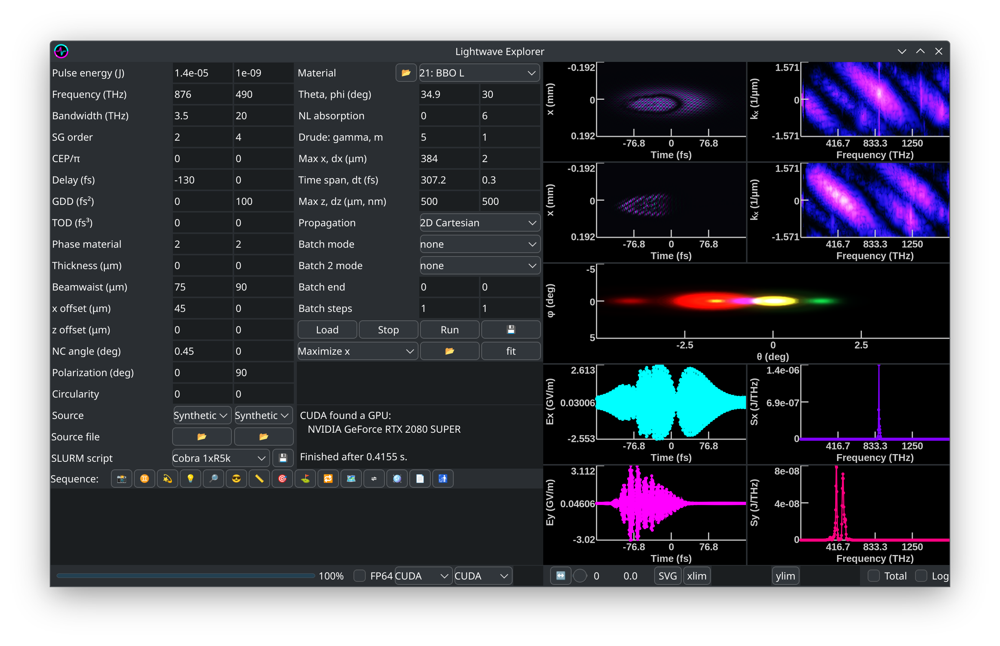

<p align="center"></p>

## <p align="center">Lightwave Explorer</p>
<p align="center">Nick Karpowicz<br>
 Max Planck Institute of Quantum Optics</p>

---
New! 

Publication!
- N. Karpowicz, Open source, heterogenous, nonlinear-optics simulation. [*Optics Continuum* **2**, 2244-2254 (2023).](https://opg.optica.org/optcon/fulltext.cfm?uri=optcon-2-11-2244&id=540999)
  
Tutorials on YouTube!
- Tutorial 1: <a href="https://youtu.be/J1-dh6V5flQ">Introduction and quick start, with walkthrough of simulating SHG and OPA</a></li>
- Tutorial 2: <a href="https://youtu.be/7osRWaI91nk">Understanding and ensuring convergence</a>
- Tutorial 3: <a href="https://youtu.be/qlcy_RBLGoU">Adding a crystal to the database</a>
- Tutorial 4: <a href="https://youtu.be/v5O0UOUdfKE">Birefringence</a>
- Tutorial 5: (new!) <a href="https://www.youtube.com/watch?v=4njswvog4bo">FDTD</a>

---
### Latest release: 2025.1
Windows: [Download .zip](https://github.com/NickKarpowicz/LightwaveExplorer/releases/latest/download/LightwaveExplorerWin64.zip)

Mac: [Download .dmg](https://github.com/NickKarpowicz/LightwaveExplorer/releases/latest/download/LightwaveExplorerMacOS.dmg) (Intel native or Rosetta on Apple silicon) or [compile it yourself](#compiling-on-mac) (Apple silicon native) 

Linux: [Get it on Flathub!](https://flathub.org/apps/io.github.NickKarpowicz.LightwaveExplorer)

Changes in 2025.1:
- Fixed a bug introduced in 2025.0 where on CUDA the plasma would not affect fields in the y-direction
- Fixed a bug where cancelling a batch job caused the subsequent batch to cancel itself
- Axes and scales are now shown on the space and momentum images, and they're also saved when an SVG is produced.
- Plot font size scaling works better with high-DPI displays
- Refactored device structures to more efficiently and consistently allocate memory
- NOTE: to read the files produced with 2025.0 and later in python, you need [this updated version of LightwaveExplorer.py](https://raw.githubusercontent.com/NickKarpowicz/LightwaveExplorer/refs/heads/master/Documentation/LightwaveExplorer.py), which at the moment can only read these new files. I'll work on a smarter version that will read both in the coming days!

Changes in 2025.0:

 - FDTD mode is more accessible: besides the options for crystals in the Propagation pulldown menu, you can also load a custom grid containing different nonlinear materials at different positions using the fdtd() function
 - FDTD reflection mode for nonlinear reflection from a surface, using the fdtdReflection() sequence command.
 - Improved convergence for the nonlinear absorption/plasma response. Note that the changes I made here will re-scale the values of the nonlinear absorption parameter (now they are consistent with what was in the paper). The conversion factor for older values is $\left(\frac{1}{2\pi\epsilon_0}\right)^{\frac{1}{N_p-1}}$ where $N_p$ is the number of photons in the multiphoton transition (divide the old value by this number).


---


### What and why

Lightwave explorer is an open source nonlinear optics simulator, intended to be fast, visual, and flexible for students and researchers to play with ultrashort laser pulses and nonlinear optics without having to buy a laser first.

<p style="text-align: center;"></p>

The simulation was written CUDA in order to run quickly on modern graphics cards. I've subsequently generalized it so that it can be run in two other ways: SYCL on CPUs and Intel GPUs, and using OpenMP to run on CPUs. Accordingly, I hope that the results are fast enough that even complicated systems can be simulated within a human attention span.

---

#### Main goals:
 - _Easily extensible database of materials:_ Eveything the program knows about nonlinear materials comes from a human-readable text file giving the appropriate coefficients and tensors. If you want to use a new material, or you've done a measurement in a new range where typical extrapolations from older data isn't relevant, it's easy to add and correct. There are places for references for the key parameters, and these references are stored in the saved simulation results for future reference. Especially if you have simulations that you checked against experiments, I'd be very happy for you to add your crystal definitions to the central database in the project Github.
 - _Accurate modeling of nonlinear optics_ using multiple, user-selectable physical models, including the unidirectional nonlinear wave equation and finite-difference time-domain approaches. This allows calculations that accommodate large systems where forward-propagation is an appropriate assumption, but also of etalon effects in thin crystals where reflections cannot be neglected.
 - _Efficient code so that complicated systems can be simulated in 3D:_ Real laser pulses can be messy, and if they weren't so before a nonlinear crystal, there's a good chance they are after (but not always). If things are slow, it's hard to go beyond one dimension on tolerable time scales, and then you miss out on the whole weird world of spatiotemporal couplings. Here you have options for rather fast simulations when there's a symmetry to apply (e.g. cylindrical or along one Cartesian dimension), alongside fully 3D propagation. Runs natively on both GPU and CPU to make use of whatever you have to work with.
 - _A graphical interface that lets you see what you're doing:_ A lot of us think in visual terms. Being able to adjust and scan parameters and immediately see what happens can really make it easier to understand what you're looking at. 
 - _A flexible sequence mode:_ By stringing together elements, not just nonlinear crystals but also spherical or parabolic mirrors, apertures, filters, free space propagation and other elements, simulate how  one interaction affects another. Sequences of events can be scripted and even programmed with loop functions to see how things change over the course of repeated interactions.
 - _Fitting modes:_ Sometimes the data that we measure depends in an interesting way on a parameter, and we'd actually like to go back and figure out what that parameter was from the data. Solving this kind of inverse problem can be tough when the parameter lives inside a partial differential equation, but by simulating the whole thing and doing a fit, you have a chance to do it! The fitting algorithm can be used to narrow down a huge space of variables to come at your best estimation of what was happening in an experiment, or to adjust your experimental system to maximize output at a given frequency.
 - _A Python module for easy postprocessing of the results:_ I hope that you get something interesting out that you want to plot and maybe publish. One of the nicest platforms for making nice plots is Python in my opinion (that's why the documentation is in a Jupyter notebook), so purely out of self interest I tried to make it easy to load the results in Python. The module also has some functions related to typical operations you'd like to do on the data to make it easy for all of us. The program also gives you a Matlab loading script for those who want to use that.
 - _Multiplatform:_ Works on Windows, Linux, and Mac.
 - _Command line interface for running on Linux/clusters:_ the simulation core can be compiled as a command line application to be controlled via the SLURM system. The GUI app can automatically configure the SLURM script, as well. I use this to run it on the clusters of the Max Planck Society, and other institutes and universities likely have similar systems. This lets you do a lot more if your personal resources are limited but you want to run simulations on a large grid or cover a lot of different parameters!

---

  ### Publications
  Lightwave Explorer has been used to perform the nonlinear optics simulations in the following papers!
  - Maciej Kowalczyk, *et al.*, Ultra-CEP-stable single-cycle pulses at 2.2 µm. [*Optica* **10**, 801-811 (2023).](https://opg.optica.org/optica/fulltext.cfm?uri=optica-10-6-801)
  - Najd Altwaijry, *et al.*, Broadband Photoconductive Sampling in Gallium Phosphide. [*Advanced Optical Materials* **11**, 2202994 (2023).](https://onlinelibrary.wiley.com/doi/full/10.1002/adom.202202994)
  - Hadil Kassab, *et al.*, In-line synthesis of multi-octave phase-stable infrared light, [*Optics Express* **31**, 24862 (2023).](https://opg.optica.org/oe/fulltext.cfm?uri=oe-31-15-24862)

---
  ### Installation on a Windows PC
  Once you've downloaded the file from the latest release above, you should just unzip it and run the exe file inside.

  If you want to use SYCL for propagation, you need to install the [Intel® oneAPI DPC++/C++ Compiler Runtime for Windows](https://www.intel.com/content/www/us/en/developer/articles/tool/oneapi-standalone-components.html).

  The Python module for working with the results is [here](https://raw.githubusercontent.com/NickKarpowicz/LightwaveExplorer/master/Documentation/LightwaveExplorer.py) in this repo; I'd recommend putting it somewhere in your Python path if you're going to work with it a lot, otherwise just copy it into your working folder.

---
### Installation on Mac

The Mac version is also available [directly from the Github relases](https://github.com/NickKarpowicz/LightwaveExplorer/releases/latest/download/LightwaveExplorerMacOS.dmg). The first time you run it, you have to right-click (or command-click) on it and select "open". You have to do this because of how Apple expects developers to pay them a subscription to release applications on their platform, and I'd rather not. For the same reason, if you want the M1,M2,M3 .etc native version, you need to compile it on your machine using the directions below.

This version makes use of the FFTW library for Fourier transforms and is therefore released under the GNU Public License v3.

The application bundle contains all the required files. If you want to edit the crystal database or default settings, open the app as a folder (right click or control-click on the app and select "show package contents") - You will find them in the Resources folder.

---

### Compiling the GUI app on Linux
You will at least need the development versions of following installed: fmt, Qt, Cairo, and TBB (these are what they are called on Fedora/dnf, the names might slightly differ on your repo):
```
fmt-devel, qt6-qtbase-devel, cairo-devel, tbb-devel
```

Next, you need a CPU-based FFT library, options are:
 - MKL from [Intel OneAPI](https://www.intel.com/content/www/us/en/developer/tools/oneapi/base-toolkit-download.html)
 - [FFTW](http://fftw.org/)

FFTW is likely available in your distribution, e.g. fftw-devel.

Next, the basic command is to use cmake in the usual way:

```
mkdir build && cd build
cmake ..
cmake --build . --config Release
```
and you should have a binary to run. You should either install it (sudo cmake --install .) or copy the files CrystalDatabase.txt and DefaultValues.ini to the build folder and run it.

The basic build will run on your CPU only.

In order to run on a GPU, the options are either CUDA (Nvidia) or SYCL (Intel, AMD or Nvidia).

#### CUDA

To enable CUDA, you need additional flags. Here's an example:
```
cmake -DUSE_CUDA=1 -DCMAKE_CUDA_HOST_COMPILER=clang++-17 -DCMAKE_CUDA_COMPILER=/usr/local/cuda/bin/nvcc -DCMAKE_CUDA_ARCHITECTURES=86 ..
```
 - USE_CUDA should just be set to 1.
 - Your CUDA_HOST_COMPILER should be a version of g++ or clang++ compatible with your version of CUDA
 - Your CUDA_ARCHITECTURES should match your card (on consumer boards: 75 for 20-series, 86 for 30-series, 89 for 40-series)

#### SYCL
A different set of flags will let you compile to use SYCL. You'll need a SYCL compiler. For Intel, you should use the one in the OneAPI basekit. For AMD, use the [open source version](https://github.com/intel/llvm).

Here's an example for AMD:
```
cmake -DUSE_SYCL=1 -DBACKEND_ROCM=gfx906 -DROCM_LIB_PATH=/usr/lib/clang/18/amdgcn/bitcode -DCMAKE_CXX_COMPILER=clang++ ..
```
  - USE_SYCL should be 1
  - BACKEND_ROCM should be set to the board architecture you want to use. This case was with a Radeon VII.
  - ROCM_LIB_PATH might not be necessary for your system, but on Fedora it was. You have to locate the bitcode folder of the ROCM install.
  - the compiler is the special version of clang++ from the [DPC++ project](https://github.com/intel/llvm)
  - rocm, hip, and rocfft must be installed on your system.

Here's an example for Intel:
```
cmake -DUSE_SYCL=1 -DCMAKE_CXX_COMPILER=icpx ..
```
  - The Intel (SPIR-V) backend is the default, so that's what you get if nothing else is specified
  - Use the Intel compiler provided by the OneAPI Base Toolkit (icpx). 
  - You will need to source the OneAPI setvars.sh script first. e.g.
  ```
  . /opt/intel/oneapi/setvars.sh
  ```

You can also use -DBACKEND_CUDA=1 to use SYCL on an Nvidia GPU.

Additional compiler flags:
  - USE_FFTW, set to 1 if it uses MKL and you don't want it to
  - CLI, set to 1 to build a command line version

---

  ### Compiling on Mac

  The first thing you'll need is [Homebrew](https://brew.sh/). If you go there, you'll see a command that you have to run in the terminal. Just paste it and follow the instructions.

  I also made a build script that you can run in the same way; just copy and paste the command below that matches your system and it will compile everything it needs and put the application in your Applications folder. It will take a while, so go get a coffee!

  (Please note that what's happening here is a shell script from the internet piped into the terminal. Never do this if you don't trust the developer, and even then it's a good idea to check the contents of the script by pasting the URL into your browser. Essentially, this is like letting me type into your Mac's terminal. I'm using it to compile the code and copy the resulting app, but someone at your terminal can also delete or copy your files.)


  Apple Silicon (M1, M2, .etc) version:

  ```
  curl -s https://raw.githubusercontent.com/NickKarpowicz/LightwaveExplorer/master/Source/BuildResources/macAutoBuild.sh | zsh -s
  ```

  Intel version:
  ```
  curl -s https://raw.githubusercontent.com/NickKarpowicz/LightwaveExplorer/master/Source/BuildResources/macAutoBuildIntel.sh | zsh -s
  ```
---
  ### Compilation on clusters
  
  A script is provided to compile the CUDA command line version on Linux. This is made specifically to work on the clusters of the MPCDF but will likely work with small modifications on other distributions depending on the local environment. The CUDA development kit and Intel OneAPI should be available in advance. With these prerequisites, the following command should work:
  ```
curl -s https://raw.githubusercontent.com/NickKarpowicz/LightwaveExplorer/master/Source/BuildResources/compileCommandLineLWEfromRepos.sh | tcsh -s
 ```
 On other clusters you might have to instead dowload the script (e.g. with wget) and change it to suit that system before you run it.

 If you have the GUI version installed locally, you can set up your calculation and then generate a SLURM script to run on the cluster (it will tell you what to do).

 ---

### Compilation on Windows
You will need: 
 - [Visual Studio 2022](https://visualstudio.microsoft.com/free-developer-offers/) to get Microsoft's compiler. 
 - [vcpkg](https://vcpkg.io), and use that to install dlib, gcem, and miniz.
 - [CMake](https://cmake.org/).
 - [CUDA development kit](https://developer.nvidia.com/cuda-downloads)
 - [Intel OneAPI](https://www.intel.com/content/www/us/en/developer/tools/oneapi/base-toolkit-download.html) (including the Math Kernel Library and the DPC++ compiler).
 - [Qt](https://www.qt.io).

If you've cloned the repo, from that folder, first make the SYCL version as a DLL:
```
mkdir build
cd build 
cmake -DMAKESYCL=1 .. -G "Visual Studio 17 2022" -A x64 -DCMAKE_TOOLCHAIN_FILE="C:/dev/vcpkg/scripts/buildsystems/vcpkg.cmake" -T "Intel(R) oneAPI DPC++ Compiler 2024"
cmake --build . --config Release
```
Next build the main application together with the CUDA version:
```
cmake --fresh .. -G "Visual Studio 17 2022" -A x64 -DCMAKE_TOOLCHAIN_FILE="C:/dev/vcpkg/scripts/buildsystems/vcpkg.cmake" -DCMAKE_CUDA_ARCHITECTURES="75;86"
cmake --build . --config Release
```

There's also a powershell script named WinBuild.ps1 in the BuildResources folder that does all of this, so you can just run "./Source/BuildResources/WinBuild.Ps1" from the repo root directory to build the whole thing.


 ---
  ### Libraries used
Thanks to the original authors for making their work available! They are all freely available, but of course have their own licenses .etc.
  - [Qt](https://qt.io): This is how the GUI is built in the newest version, and is why it should now use the native style on Windows, Mac, and Linux.
  - [NVIDIA CUDA](https://developer.nvidia.com/cuda-toolkit): This provides the basic CUDA runtime, compiler, and cuFFT, for running the simulations on NVIDIA GPUs, and is the basis of the fastest version of this code.
  - [Intel OneAPI](https://www.intel.com/content/www/us/en/developer/tools/oneapi/overview.html), specifically the [Math Kernel Library](https://www.intel.com/content/www/us/en/developer/tools/oneapi/onemkl.html#gs.cw3ci4): This is used for performing fast fourier transforms when running in CPU mode. The DPC++ compiler allows the program to run on both CPUs and a wider range of GPUs, including the integrated ones on Intel chips. I found that on my rather old laptop, SYCL on the GPU is several times faster than running on CPU, so it's useful even for systems without dedicated GPUs.
  - [Dlib](http://dlib.net/): This library is the basis of the optimization routines. I make use of the global optimization functions for the fitting/optimization modes. The library is [available on Github](https://github.com/davisking/dlib), and their excellent documentation and further information is on the [main project website](http://dlib.net/).
  - [FFTW](https://www.fftw.org/): This is used for Fast Fourier Transforms in the GPL 3.0 version (i.e. the CPU-only Linux and Mac versions). On a given CPU this is on average the fastest FFT you can find.
  - [miniz](https://github.com/richgel999/miniz): Nice and easy to use C library for making/reading .zip archives.
  
  ---

  ### Programming note

  The code is written in a "trilingual" way - a single core code file is compiled (after some includes and preprocessor definitions) by the three different compilers, Nvidia nvcc, a c++ compiler (either Microsoft's, g++, or clang++ have all worked), and Intel dpc++. 

  Although CUDA was the initial platform and what I use (and test) most extensively, I've added two additional languages for those who don't have an Nvidia graphics card. 
  
  One is in c++, with multithreading done with either with OpenMP or using C++ parallel execution policies. 
  
  The other language is SYCL. This also allows the simulation to run on the CPU and should allow it to run on Intel's graphics cards, as well as the integrated graphics of many Intel CPUs, and GPUs from AMD.
    
  The different architectures are using the same algorithm, aside from small differences in their floating point math and intrinsic functions. So when I make changes or additions, there will never be any platform gaining over the other (again, reproducibility by anyone is part of the goals here).
